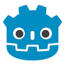

 <div align="justify">
<a name="top"></a>
<div style="display: flex; align-items: center; justify-content: space-between;">
  
  <h1 style="margin: 0;">Trilha Godot</h1>
</div>

## Descrição

Este repositório contém os projetos e exercícios desenvolvidos durante o bootcamp "Trilha Godot". Este bootcamp teve como objetivo fornecer uma compreensão profunda do Godot Engine, uma poderosa ferramenta open-source para desenvolvimento de jogos. Aqui você encontrará desde projetos simples, focados em mecânicas básicas, até projetos mais complexos, demonstrando funcionalidades avançadas da engine.

## Índice

- [Sobre o Bootcamp](#sobre-o-bootcamp)
- [Conteúdos Aprendidos](#conteúdos-aprendidos)
- [Projetos Desenvolvidos](#projetos-desenvolvidos)
- [Como Executar os Projetos](#como-executar-os-projetos)
- [Visualização do Projeto](#visualização-do-projeto)
- [Requisitos](#requisitos)
- [Contribuições](#contribuições)
- [Licença](#licença)

## Sobre o Bootcamp

O bootcamp "Trilha Godot" foi um curso intensivo voltado para desenvolvedores de jogos, abrangendo desde os conceitos básicos até técnicas avançadas de desenvolvimento com Godot. O curso incluiu:

- Introdução ao Godot Engine
- Programação com GDScript
- Criação de cenas e nodes
- Física 2D
- Animações
- Interface do Usuário (UI)
- Exportação e publicação de jogos
<br>

<a href="#top">
Voltar
</a>

## Conteúdos Aprendidos

Durante o bootcamp, foram abordados os seguintes tópicos:

- **Fundamentos da Godot Engine:** Interface, cena, nodes, e instâncias.
- **Programação com GDScript:** Variáveis, funções, loops, condicionais, e mais.
- **Desenvolvimento 2D:** Manipulação de sprites, colisões, física, e renderização.
- **Animações:** Animações de personagens, transições, e uso do AnimationPlayer.
- **UI e Interatividade:** Criação de interfaces, interação com o jogador, e menus.
- **Publicação de Jogos:** Configuração de exportação e publicação para diferentes plataformas.
<br>

<a href="#top">
Voltar
</a>

## Projetos Desenvolvidos

### 1. Projeto Inicial: "Primeira Experiência"
- Descrição: Primeiro projeto para familiarização com a interface do Godot.
- Arquivo principal: `world`

### 2. Jogo de Plataforma 2D
- Descrição: Jogo de plataforma simples com movimentação e colisão.
- Arquivo principal: `player`

### 3. Projeto Final: Tiny Dark Knight
- Descrição: Jogo RPG com combate, inimigos e cenário.
- Arquivo principal: `main`
<br>

<a href="#top">
Voltar
</a>
</div>

## Como Executar os Projetos

Para executar qualquer um dos projetos, siga os passos abaixo:

1. Clone este repositório:
   ```sh
   https://github.com/AngeloSouza1/proj-godot.git
<a href="#top">
Voltar
</a>

## Visualização do Projeto

https://vimeo.com/950045452/5dce1579a8

<a href="#top">
Voltar
</a>
## Contribuições
Contribuições são bem-vindas! Se você quiser contribuir para o projeto, siga estas etapas:

- Faça um fork do projeto.

- Crie uma nova branch com a sua feature: git checkout -b minha-feature

- Faça commit das suas alterações: git commit -m 'Adicionar nova feature'

- Faça push para a branch: git push origin minha-feature

- Envie um pull request.

<br>
<a href="#top">
Voltar
</a>

## Requisitos
- Godot Engine: Versão 4.2.1 ou superior.
- Git: Para clonar este repositório.

<br>
<a href="#top">
Voltar
</a>

## Licença

Este projeto está licenciado sob a MIT License.
<br>

<a href="#top">
Voltar
</a>

